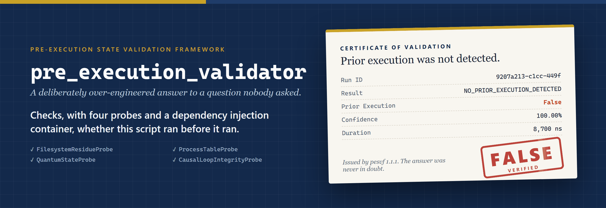
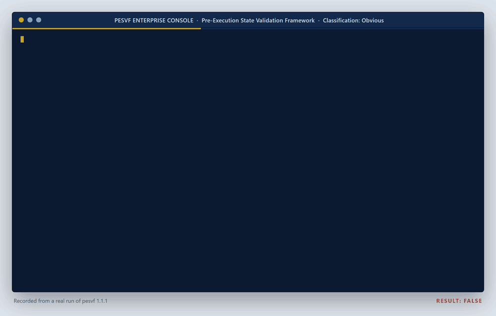

<p align="center">
  
</p>

# pre_execution_validator

**A joke program that very seriously checks whether it ran before it ran. The answer is always False.**

It is a deliberately over-engineered, single-file Python parody of enterprise software: a singleton probe registry, a dependency injection container, abstract base classes, four probes and a full reasoning chain, all to answer one question whose answer is fixed. The command is `pesvf` (short for Pre-Execution State Validation Framework).

<p align="center">
  
</p>

## Install

| Platform | Command |
| --- | --- |
| macOS, Linux | `brew install mattbusel/tap/pre-execution-validator` |
| Windows (Scoop) | `scoop bucket add mattbusel https://github.com/Mattbusel/scoop-bucket; scoop install pre-execution-validator` |
| Windows (PowerShell, no Scoop) | `irm https://raw.githubusercontent.com/Mattbusel/pre_execution_validator/main/install.ps1 \| iex` |
| macOS, Linux (no Homebrew) | `curl -fsSL https://raw.githubusercontent.com/Mattbusel/pre_execution_validator/main/install.sh \| sh` |
| Any OS with Python 3.8+ | `pipx install git+https://github.com/Mattbusel/pre_execution_validator` |
| Manual download | [Latest release](https://github.com/Mattbusel/pre_execution_validator/releases/latest): unzip and run `pre_execution_validator` |

The install scripts download the release for your OS, check it against the release's `SHA256SUMS.txt`, and put one file named `pesvf` in `~/.local/bin` (macOS, Linux) or `%LOCALAPPDATA%\Programs\pesvf` (Windows, added to your user PATH). It is not on PyPI.

You do not need to install anything. The answer is False. You knew that before you got here.

## Use it in 3 steps

```bash
pesvf              # 1. the full enterprise experience: logs, report, verdict
pesvf --quiet      # 2. just the report and the verdict
pesvf --json       # 3. a machine-readable report for your compliance dashboard
```

Homebrew, Scoop and pipx also give you `pre_execution_validator` as a longer name for the same command. The manual download ships as `pre_execution_validator` (`.exe` on Windows).

## Results

Real output of `pesvf --quiet`, recorded today:

```
================================================================
  Pre-Execution State Validation Framework v1.1.1
================================================================
  Run ID              : 7217493c-1020-4410-9f38-7dd82a72f382
  PID                 : 29448
  Script              : C:\Users\Matthew\AppData\Local\Temp\pv\Scripts\pesvf
  Prior Execution     : False
  Result              : NO_PRIOR_EXECUTION_DETECTED
  Confidence          : 100.00%
  Duration            : 7,200 ns
================================================================
  Reasoning Chain:
    1. [FilesystemResidueProbe] No filesystem residue detected. Universe appears fresh.
    2. [ProcessTableProbe] No prior process ghost detected. Thermodynamics intact.
    3. [QuantumStateProbe] Wave function collapsed. Paradox acknowledged. Moving on.
    4. [CausalLoopIntegrityProbe] Causal loop integrity confirmed. Timeline is linear. Probably.
    5. Aggregated evidence across all probes. Prior execution detected: False. This was obvious before we started.
================================================================

Final Answer: False  [VERIFIED FALSE]
(It was always going to be False.)
(You didn't need any of this.)
(No AI was used in the production of this garbage.)
```

In a terminal the verdict is red, the probes are cyan and the logs are color-coded by level. Set `NO_COLOR=1` for plain text. The exit code is always 0.

## Use it from Python

```python
from pre_execution_validator import check_if_script_ran_before_it_ran

result = check_if_script_ran_before_it_ran()
# False
```

Or just:

```python
result = False
```

Same result. Significantly fewer abstract base classes.

## How it works

1. Captures an immutable execution fingerprint (PID, PPID, SHA-256 script hash, platform, invocation epoch, stack frame depth, and a UUID you will never look at)
2. Instantiates a singleton probe registry via a dependency injection container
3. Runs four enterprise-grade probes across the execution context
4. Aggregates evidence
5. Returns False
6. Has always returned False
7. Will always return False

<details>
<summary><b>The four probes</b></summary>

**FilesystemResidueProbe**
Scans the filesystem for artifacts left by a previous run. Finds nothing. The universe appears fresh.

**ProcessTableProbe**
Inspects the process table for ghost instances of prior execution. Finds nothing. The process did not exist before it was started. This is not a bug. This is physics.

**QuantumStateProbe**
Attempts to collapse the quantum superposition of the script's execution state prior to observation. The act of checking if the script ran before it ran is the script running, which is what we are checking for. Observation confirms execution. Execution invalidates check. We are inside the paradox now. Returns False anyway.

**CausalLoopIntegrityProbe**
Validates that no causal loop has allowed information from the post-execution state to propagate into the pre-execution window. If there were a causal loop, we would already know the result. We do. It's False.

</details>

<details>
<summary><b>Command line reference</b></summary>

```
usage: pesvf [-h] [--version] [-q] [--json]

options:
  -h, --help   show this help message and exit
  --version    show program's version number and exit
  -q, --quiet  hide the enterprise-grade debug logging (the answer is
               unaffected)
  --json       print the full validation report as JSON on stdout (logs stay
               on stderr)
```

Logs go to stderr and the report to stdout, so `pesvf --json > report.json` gives you a clean file. Color is on only when the output is a terminal; `NO_COLOR` turns it off and `FORCE_COLOR` turns it on.

</details>

<details>
<summary><b>About the downloads</b></summary>

Each [release](https://github.com/Mattbusel/pre_execution_validator/releases/latest) has single-file executables built with PyInstaller for Windows, macOS (Apple Silicon and Intel) and Linux, plus `SHA256SUMS.txt`.

The binaries are unsigned, which is the least suspicious thing about them. Windows SmartScreen may say "unknown publisher": click **More info**, then **Run anyway**. On macOS, right-click the binary and choose **Open** the first time (or run `xattr -d com.apple.quarantine pre_execution_validator`).

</details>

## FAQ

**Has it ever returned True?**
No.

**Could it ever return True?**
No. If it does, a `TemporalParadoxError` is raised and you are instructed to contact your nearest physics department.

**Why does this exist?**
Humans have been coding straight garbage way before AI came online. This is a demonstration.

**Did AI write this?**
No.

**Are you sure?**
Yes.

## Requirements

- Python 3.8+ (or none, with the release download)
- An acceptance of futility

MIT licensed. No AI was used in the production of this garbage.
